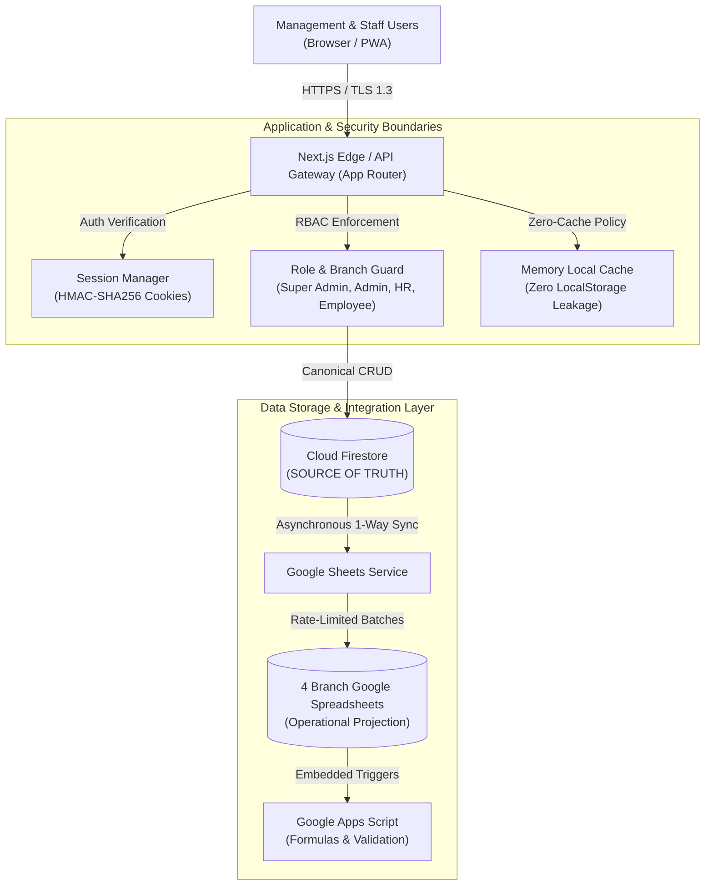

# Gateway Software Solutions (GSS) Management System
### Enterprise Workforce Operations & Mentorship Governance Platform

[]()
[-black.svg)](https://nextjs.org/)
[](https://react.dev/)
[](https://www.typescriptlang.org/)
[](https://firebase.google.com/docs/firestore)
[-brightgreen.svg)]()
[]()

---

## 1. Executive Summary & Purpose

The **Gateway Software Solutions (GSS) Management System** is a unified, enterprise-grade operations, attendance governance, task delegation, and student mentorship platform engineered specifically for **Gateway Software Solutions** across its four regional technology branches in Tamil Nadu:

* **Coimbatore (CBE):** Corporate Headquarters & Main Training Hub
* **Chennai (CHN):** Technology Center & OMR IT Corridor Hub
* **Madurai (MDU):** Regional Training & Software Development Hub
* **Erode (ERD):** Regional Technology Operations & Skill Hub

The platform centralizes real-time personnel time tracking, mentor-student cohorts, multi-month attendance rollovers, candidate inquiry pipelines, and corporate document generation (`.xlsx`, `.docx`) into a single high-performance progressive web application.

---

## 2. Key Capabilities & Feature Matrix

| Capability / Module | Route | Target Roles | Core Features |
| :--- | :--- | :--- | :--- |
| **Executive Dashboard** | `/dashboard` | All Personnel | Real-time punch in/out, daily planned tasks, elapsed working time calculation, and personal metrics. |
| **Daily Worklog** | `/worklog` | All Personnel | Task point tracking, two-step punch out confirmation, and mandatory incomplete task reason verification. |
| **Mentorship Roster** | `/my-students` | Staff, Admin, Super Admin | Multi-month student attendance matrix (`ATT_{staffId}`), milestone evaluations, and practical submissions. |
| **Student Directory** | `/students` | All Personnel | Centralized branch-scoped student repository (`06_Student_Directory`) with instant Excel exports. |
| **Master Attendance** | `/admin/attendance` | Admin, Super Admin, HR | 26-day working calendar grid (excluding Sundays per corporate policy) with interactive status cycling. |
| **Staff Directory** | `/admin/directory` | Admin, Super Admin, HR | Branch-scoped employee roster, login/logout records, designations, and performance dossiers. |
| **Task Delegation** | `/tasks` | All Personnel | Single-row multi-assignee task allocations, interactive Kanban progression, and automated alerts. |
| **Candidate Inquiries** | `/leads` | HR, Admin, Super Admin | Drag-and-drop CSV/Excel intake, automated deduplication by primary email and mobile number. |
| **Corporate Reporting** | `/reports` | All Personnel | Automated monthly attendance reports, executive previews, and one-click `.xlsx` / `.docx` document generation. |
| **User Administration** | `/admin/users` | Admin, Super Admin | Double-confirmation role elevation, branch scoping, and account lifecycle activation. |
| **Account Approvals** | `/admin/approvals` | Admin, Super Admin | Incoming employee registration review and authorization pipeline. |
| **Audit Ledger** | `/admin/audit` | Admin, Super Admin | Append-only non-repudiable audit ledger capturing all privileged actions and state mutations. |

---

## 3. High-Level System Architecture



---

## 4. Technology Stack

* **Application Framework:** [Next.js 16.3.5](https://nextjs.org/) (App Router, Turbopack, Server Actions)
* **Frontend Library:** [React 19.2.8](https://react.dev/) + [TypeScript 5.x](https://www.typescriptlang.org/)
* **Styling & Design System:** [TailwindCSS v4](https://tailwindcss.com/) + Glassmorphism Design System
* **Database & Identity:** [Cloud Firestore](https://firebase.google.com/docs/firestore) + [Firebase Authentication](https://firebase.google.com/docs/auth) + [Firebase Admin SDK](https://firebase.google.com/docs/admin/setup)
* **External Integration:** [Google Sheets API v4](https://developers.google.com/sheets/api) via Cloud Service Account + [Google Apps Script](https://developers.google.com/apps-script)
* **Document Generation:** [xlsx](https://www.npmjs.com/package/xlsx) (Excel) + [docx](https://www.npmjs.com/package/docx) (Word)
* **Testing & Quality Assurance:** [Jest 30](https://jestjs.io/) + [Playwright](https://playwright.dev/)
* **Process Management:** [Docker](https://www.docker.com/) (Alpine Multi-Stage) + [PM2 Cluster](https://pm2.keymetrics.io/) + [NGINX](https://www.nginx.com/)

---

## 5. Security & Governance Principles

1. **Zero-Cache Client Memory:** Client-side persistence is restricted to ephemeral in-memory cache (`memoryLocalCache()`), eliminating cross-user data leakage on shared workstations.
2. **Hardware-Isolated Branch Scoping:** Regional roles (`admin`, `hr`, `employee`) can only access data bound to their home branch (`CHN`, `CBE`, `MDU`, `ERD`).
3. **Double-Confirmation Role Elevation:** Elevating account permissions requires explicit multi-step verification.
4. **Mandatory Incomplete Task Justification:** Employees cannot complete evening punch-out without documenting justifications for unfulfilled planned deliverables.
5. **Secret Isolation:** Service account private keys and operational secrets are kept strictly server-side and excluded from source control.

---

## 6. Quick Start & Local Development

### Prerequisites
* Node.js `>= 20.0.0`
* npm `>= 10.0.0`

### Setup Instructions
```bash
# 1. Clone the repository
git clone https://github.com/gsschennaiprojects/Gateway-Management-System.git
cd Gateway-Management-System

# 2. Install dependencies across the monorepo
npm install

# 3. Configure environment variables
cp .env.example .env.local

# 4. Start local development server (Turbopack)
npm run dev
```

Open [http://localhost:3000](http://localhost:3000) to access the application.

---

## 7. Verification & Quality Commands

```bash
# Run ESLint compliance check
npm run lint

# Run TypeScript compiler check
npm run typecheck

# Run Jest unit and integration tests (19 test suites, 61 tests)
npm test

# Run Playwright End-to-End browser tests
npm run test:e2e

# Run load and concurrency benchmark
npm run test:benchmark

# Build production bundle
npm run build
```

---

## 8. Enterprise Documentation Portal

Comprehensive architectural specifications and operational runbooks are maintained under the [docs/](file:///c:/Users/jasva/Desktop/project/GMS/docs) directory:

* 🏛️ **[System Architecture](file:///c:/Users/jasva/Desktop/project/GMS/docs/architecture/system-architecture.md)** — Architectural blueprint and data flow
* 🗄️ **[Firestore Schema](file:///c:/Users/jasva/Desktop/project/GMS/docs/database/firestore-schema.md)** — Collections, rules, and indexes specification
* 🔒 **[Security & RBAC](file:///c:/Users/jasva/Desktop/project/GMS/docs/security/security-and-rbac.md)** — Role permissions and zero-cache model
* 🚀 **[Deployment Guide](file:///c:/Users/jasva/Desktop/project/GMS/docs/deployment/production-deployment.md)** — Vercel, Docker, and PM2 deployment
* 📊 **[Google Sheets Projection](file:///c:/Users/jasva/Desktop/project/GMS/docs/operations/google-sheets-projection.md)** — 1-way sync and quota resilience
* 👥 **[Role Workflows](file:///c:/Users/jasva/Desktop/project/GMS/docs/user-guides/role-workflows.md)** — User manuals for Super Admin, Admin, HR, and Staff
* 🏢 **[Platform Overview](file:///c:/Users/jasva/Desktop/project/GMS/docs/business/management-platform-overview.md)** — Executive B2B platform summary

---

## 9. License

This project is licensed under the MIT License — see the [LICENSE](file:///c:/Users/jasva/Desktop/project/GMS/LICENSE) file for details.
