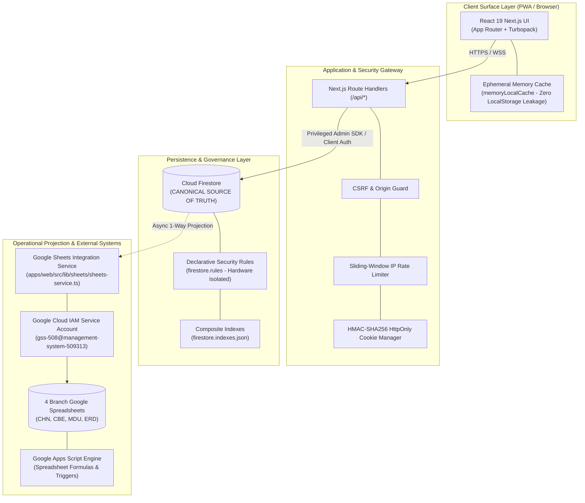

# System Architecture & Technical Design Specification

**Gateway Software Solutions (GSS) Management System**  
**Document ID:** `DOC-ARCH-001`  
**Classification:** Enterprise System Architecture Specification  
**Status:** Production Ready  
**Version:** 1.0.0  
**Last Updated:** 2026-09-30  

---

## 1. Architectural Principles

1. **Unified Modern Monorepo:** Next.js 16 (App Router) serves both the high-performance user interface and server-side Route Handlers as a unified deployable system (`apps/web`).
2. **Canonical System of Record (Source of Truth):** Google Cloud Firestore is the authoritative, transactional source of truth for all users, permissions, tasks, worklogs, student rosters, and audit trails.
3. **Controlled 1-Way Operational Projection:** Google Sheets functions strictly as an asynchronous operational projection for executive visibility and offline spreadsheet workflows. The web application's server-side service account is the sole authorized writer to branch spreadsheets.
4. **Defense-in-Depth RBAC:** Security and branch isolation are enforced at the network edge, inside Route Handlers, and at the database rules layer (`firestore.rules`). UI visibility checks are conveniences, never security boundaries.
5. **Zero-Cache Client Memory:** To eliminate data leakage on shared lab terminals, browser `localStorage` is prohibited from persisting business data; the Firestore SDK enforces `memoryLocalCache()`.
6. **Provider-Agnostic & Standards-Based:** External integrations (Google Sheets API v4, Firebase Auth, crypto libraries) communicate through isolated service abstractions (`@/lib/firebase/firebase-admin`, `@/lib/sheets/sheets-service`).

---

## 2. High-Level Architecture Diagram



---

## 3. Technology Stack & Component Inventory

| Architectural Layer | Technology Selection | Version | Operational Justification |
| :--- | :--- | :--- | :--- |
| **Application Framework** | **Next.js** | `16.3.5` | Monorepo App Router with Turbopack compilation and Route Handlers. |
| **UI Library** | **React** | `19.2.8` | Concurrent rendering, Server Actions, modern hooks. |
| **Type Safety** | **TypeScript** | `5.x` | Strict type validation with `@/*` path mapping and zero compile errors. |
| **Styling & Theming** | **TailwindCSS** | `v4` | Modern CSS tokens, dark mode palette, glassmorphism panels. |
| **Transactional Database** | **Google Cloud Firestore** | Datastore Native | Real-time listeners, composite querying, declarative security rules. |
| **Identity & Authentication** | **Firebase Auth + Admin SDK** | `12.19.0` / `14.4.0` | Email/mobile credential verification, privileged server mutations. |
| **Operational Projection** | **Google Sheets API v4** | `googleapis 181.0.0` | Rate-limited batch updates via Cloud IAM service account. |
| **Spreadsheet Automation** | **Google Apps Script** | V8 Runtime | Native spreadsheet formula validation, tab creation, and layout formatting. |
| **Corporate Exports** | **xlsx + docx** | `0.18.5` / `9.7.1` | Direct generation of styled `.xlsx` workbooks and formal `.docx` dossiers. |
| **Testing Harness** | **Jest + Playwright** | `30.5.2` / `1.63.0` | 19 Jest unit/integration test suites + multi-browser E2E testing. |
| **Container & Process Runtime** | **Docker + PM2 + NGINX** | Production | Alpine multi-stage container build, cluster mode, and reverse proxy. |

---

## 4. Source of Truth & Data Flow Architecture

```
[ User Input / Action ]
          │
          ▼
[ Validation & Schema Guard (TypeScript + Zod) ]
          │
          ▼
[ Security & Branch Boundary Authorization (RBAC) ]
          │
          ▼
[ Cloud Firestore Commit (Canonical Record) ] ──────► [ Immediate HTTP 200 to User ]
          │
          ▼ (Asynchronous)
[ Operational Projection Service (Rate-Limited Queue) ]
          │
          ▼
[ Branch Google Spreadsheet (CHN / CBE / MDU / ERD) ]
          │
          ▼
[ Google Apps Script (Formatting & Aggregation) ]
```

### Data Lineage & Synchronization Direction

| Domain / Entity | Canonical Store | Secondary Relationship | Synchronization Cadence |
| :--- | :--- | :--- | :--- |
| **User Accounts & Roles** | Cloud Firestore (`users`) | Auth UID pointer in Firebase Auth | Synchronous on account creation / elevation |
| **Branch Governance & Settings** | Cloud Firestore (`branches`) | `00_Branch_Details` in Spreadsheet | Synchronous initialization, read-cached |
| **Tasks & Finite State Machine** | Cloud Firestore (`tasks`) | `TSK_{StaffId}` in Branch Sheet | Immediate commit, async spreadsheet append |
| **Daily Worklogs & Punch Times** | Cloud Firestore (`worklogs`) | `WL_{StaffId}` in Branch Sheet | Immediate commit, async spreadsheet append |
| **Personnel Attendance Grid** | Cloud Firestore (`attendance`)| `04_Staff_Attendance` in Sheet | Real-time cell mutation, async row append |
| **Student Mentorship Cohorts** | Cloud Firestore (`students`) | `STU_{StaffId}` & `06_Student_Directory` | Real-time commit, async spreadsheet update |
| **Audit Ledger** | Cloud Firestore (`audit_logs`)| `09_System_Audit_Log` in Sheet | Append-only non-repudiable audit write |

---

## 5. Security & Isolation Boundaries

1. **Hardware-Isolated Regional Boundaries:** Regional users (`admin`, `hr`, `employee`, `intern`) are strictly bound to their regional branch code (`CHN`, `CBE`, `MDU`, `ERD`). The database rules engine unconditionally rejects cross-branch document access.
2. **Zero-Cache Client Security:** Ephemeral in-memory caching (`memoryLocalCache()`) prevents sensitive workforce and student data from surviving browser tab closures.
3. **Double-Confirmation Role Transitions:** Administrative role elevations require explicit multi-step verification, captured in the immutable audit ledger.
4. **Mandatory Incomplete Task Justification:** Personnel cannot confirm evening punch-out without providing documented justifications for incomplete planned deliverables.
