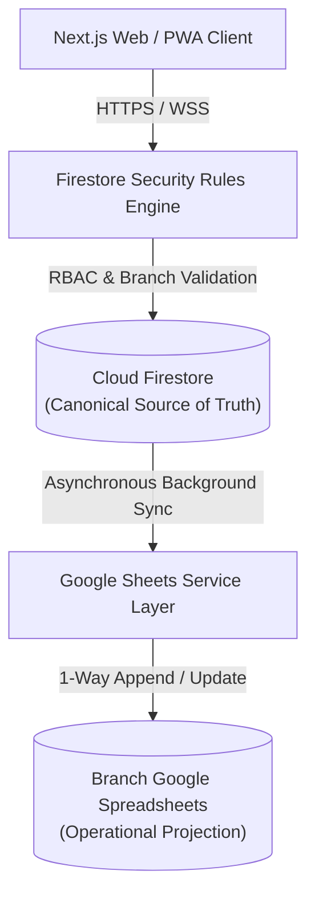

# Cloud Firestore Schema & Data Governance Specification

**Gateway Software Solutions (GSS) Management System**  
**Document ID:** `DOC-DB-001`  
**Classification:** Enterprise Internal Technical Standard  
**Status:** Production Ready  
**Last Updated:** 2026-09-30  

---

## 1. Architectural Role of Cloud Firestore

In the GSS enterprise architecture, **Google Cloud Firestore (Datastore Native Mode)** is the **canonical system of record (Source of Truth)** for all transactional entities, identity profiles, access controls, task finite state machines, and operational audit trails.

### Key Principles
1. **Source of Truth:** All mutations (creates, updates, state transitions) commit to Firestore first.
2. **Zero-Cache Security:** Client-side persistence is restricted to ephemeral in-memory cache (`memoryLocalCache()`), preventing cross-user data leakage on shared enterprise workstations.
3. **Hardware-Isolated Scoping:** Every document strictly maps to a canonical branch (`CHN`, `CBE`, `MDU`, `ERD`). Branch boundaries are unconditionally enforced at the database rules layer.
4. **Append-Only Auditing:** Destructive deletes on core entities are blocked. Mutations generate immutable audit entries in `audit_logs`.

---

## 2. Canonical Collections Specification

### 2.1 Collection: `branches`
Stores institutional metadata, operating hours, and configuration for the 4 regional operational centers.

* **Path:** `/branches/{branchId}`
* **Document ID Format:** Canonical Branch Identifier (`BR_CHN_01`, `BR_CBE_02`, `BR_MDU_03`, `BR_ERD_04`)

| Field Name | Type | Required | Constraints / Description |
| :--- | :--- | :--- | :--- |
| `branchId` | string | Yes | Unique ID (e.g. `BR_CHN_01`) |
| `branchCode` | string | Yes | `CHN` \| `CBE` \| `MDU` \| `ERD` |
| `branchName` | string | Yes | Official branch title (e.g. `Gateway Chennai Branch`) |
| `location` | string | Yes | City and geographical location |
| `address` | string | Yes | Full corporate postal address |
| `contactEmail` | string | Yes | Operational contact email |
| `contactPhone` | string | Yes | Direct telephony support number |
| `workStartTime` | string | Yes | Shift commencement time (e.g. `09:00 AM`) |
| `workEndTime` | string | Yes | Shift conclusion time (e.g. `06:30 PM`) |
| `status` | string | Yes | `Active` \| `Inactive` |
| `spreadsheetId`| string | Yes | Target Google Spreadsheet ID for 1-way projection |

---

### 2.2 Collection: `users`
Stores user profile records, security status, and branch assignments.

* **Path:** `/users/{uid}`
* **Document ID Format:** Firebase Authentication UID or canonical Staff ID (`GSS_SA_001`, `CBE_ADM01`, etc.)

| Field Name | Type | Required | Description |
| :--- | :--- | :--- | :--- |
| `id` | string | Yes | Firebase Auth UID or system user ID |
| `staffId` | string | Yes | Unique corporate employee identifier |
| `email` | string | Yes | Unique corporate email address |
| `name` | string | Yes | Full employee name |
| `mobile` | string | Yes | Verified telephony number (10 digits) |
| `role` | string | Yes | `superadmin` \| `admin` \| `hr` \| `employee` \| `intern` |
| `branch` | string | Yes | Primary branch code: `CHN` \| `CBE` \| `MDU` \| `ERD` \| `ALL` |
| `status` | string | Yes | `active` \| `pending` \| `rejected` \| `disabled` |
| `department` | string | No | Functional unit (e.g. `Training`, `Operations`) |
| `designation` | string | No | Corporate job title |
| `passwordHash` | string | No | Scrypt salted password digest (fallback/upgrade flow) |
| `lastLoginAt` | timestamp | No | UTC timestamp of most recent authenticated session |
| `createdAt` | timestamp | Yes | UTC creation timestamp |
| `updatedAt` | timestamp | Yes | UTC last-modified timestamp |

---

### 2.3 Collection: `tasks`
Manages task allocation, multi-assignee tracking, priority levels, and finite-state workflow history.

* **Path:** `/tasks/{taskId}`
* **Document ID Format:** `TASK_<UUID>` or `TSK_<BRANCH>_<NUMBER>`

| Field Name | Type | Required | Description |
| :--- | :--- | :--- | :--- |
| `id` | string | Yes | Task document identifier |
| `branch` | string | Yes | Associated branch code (`CHN`, `CBE`, `MDU`, `ERD`) |
| `title` | string | Yes | Brief actionable summary |
| `description` | string | No | Comprehensive task requirements |
| `category` | string | Yes | `Training` \| `Operations` \| `Development` \| `Administrative` |
| `priority` | string | Yes | `low` \| `medium` \| `high` \| `urgent` |
| `status` | string | Yes | `not_started` \| `in_progress` \| `completed` \| `blocked` |
| `targetGroup` | string | Yes | `individual` \| `department` \| `all` |
| `assignedToStaffIds`| array<string> | Yes | Array of assigned employee Staff IDs |
| `assigneeNames`| array<string> | No | Cached display names of assignees |
| `dueDate` | string | Yes | Target completion date (`YYYY-MM-DD`) |
| `createdBy` | string | Yes | Staff ID or UID of allocating supervisor |
| `creatorRole` | string | Yes | Role of allocator at time of creation |
| `incompleteReason` | string | No | Mandatory justification if logged out without completing |
| `completedAt` | string | No | Timestamp of completion |
| `history` | array<map> | No | Audit trail of state transitions |

---

### 2.4 Collection: `students`
Manages academic admissions, mentorship cohort alignment, internship tenures, and training progress.

* **Path:** `/students/{studentId}`
* **Document ID Format:** Canonical Student Registration Code (`STU_<UUID>` or `GSS_<YEAR>_<NUMBER>`)

| Field Name | Type | Required | Description |
| :--- | :--- | :--- | :--- |
| `id` | string | Yes | Internal document identifier |
| `studentId` | string | Yes | Student registration code |
| `studentName` | string | Yes | Full legal name of student |
| `branch` | string | Yes | Branch of enrollment (`CHN`, `CBE`, `MDU`, `ERD`) |
| `college` | string | Yes | Institution / University of origin |
| `department` | string | Yes | Academic major (e.g. `Computer Science`) |
| `year` | string | Yes | Academic year (`1st`, `2nd`, `3rd`, `Final Year`) |
| `email` | string | Yes | Candidate contact email |
| `mobile` | string | Yes | Candidate mobile number |
| `course` | string | Yes | Enrolled training course title |
| `domain` | string | Yes | Technical focus (e.g. `Full Stack Web Development`) |
| `mentorStaffId`| string | Yes | Assigned staff member / mentor ID |
| `mentorName` | string | Yes | Name of assigned mentor |
| `admissionDate`| string | Yes | Start date (`YYYY-MM-DD`) |
| `endDate` | string | Yes | Scheduled conclusion date (`YYYY-MM-DD`) |
| `feeStatus` | string | Yes | `Paid` \| `Partial` \| `Pending` |
| `projectStatus`| string | Yes | `Not Started` \| `In Progress` \| `Submitted` \| `Evaluated` |
| `projectTitle` | string | No | Assigned capstone or internship project title |
| `studentStatus`| string | Yes | `Active` \| `Completed` \| `Discontinued` |

---

### 2.5 Collection: `worklogs`
Captures daily employee operational time tracking, planned tasks, completed deliverables, and punch records.

* **Path:** `/worklogs/{logId}`
* **Document ID Format:** `{date}_{staffId}` (e.g. `2026-09-30_CBE_EMP01`)

| Field Name | Type | Required | Description |
| :--- | :--- | :--- | :--- |
| `id` | string | Yes | Composite document key (`{date}_{staffId}`) |
| `date` | string | Yes | ISO Date string (`YYYY-MM-DD`) |
| `staffId` | string | Yes | Employee Staff ID |
| `staffName` | string | Yes | Employee display name |
| `branch` | string | Yes | Working branch location |
| `loginTime` | string | Yes | Morning punch-in time (`HH:MM AM/PM`) |
| `logoutTime` | string | No | Evening punch-out time (`HH:MM AM/PM`) |
| `totalHours` | number | No | Calculated working hours (decimal) |
| `plannedTasks`| array<string>| Yes | List of deliverables planned during punch-in |
| `completedTasks`| array<string>| No | List of verified completed deliverables |
| `incompleteReason`| string | No | Enforced justification if completed < planned |
| `status` | string | Yes | `draft` \| `submitted` \| `verified` |

---

### 2.6 Collection: `attendance`
Master daily personnel presence record, powering the branch attendance grid and automated payroll exports.

* **Path:** `/attendance/{attendanceId}`
* **Document ID Format:** `{date}_{staffId}` (e.g. `2026-09-30_CBE_EMP01`)

| Field Name | Type | Required | Description |
| :--- | :--- | :--- | :--- |
| `id` | string | Yes | Composite attendance identifier |
| `date` | string | Yes | Calendar date (`YYYY-MM-DD`) |
| `staffId` | string | Yes | Staff member identifier |
| `staffName` | string | Yes | Staff member name |
| `branch` | string | Yes | Branch code (`CHN`, `CBE`, `MDU`, `ERD`) |
| `role` | string | Yes | User role at time of recording |
| `status` | string | Yes | `Present` \| `Absent` \| `Half Day` \| `On Duty` \| `Leave` |
| `loginTime` | string | No | Punch-in timestamp string |
| `logoutTime` | string | No | Punch-out timestamp string |
| `workingHours`| number | No | Net verified working hours |
| `markedBy` | string | Yes | `system` \| `self` \| Admin Staff ID |

---

### 2.7 Collection: `audit_logs`
Enterprise security and governance ledger tracking privileged actions, role changes, and system events.

* **Path:** `/audit_logs/{auditId}`
* **Document ID Format:** `AUDIT_<TIMESTAMP>_<RANDOM>`

| Field Name | Type | Required | Description |
| :--- | :--- | :--- | :--- |
| `id` | string | Yes | Unique audit entry identifier |
| `actorId` | string | Yes | Staff ID or UID of user initiating action |
| `actorName` | string | Yes | Display name of actor |
| `actorRole` | string | Yes | Security role of actor |
| `action` | string | Yes | Action code (e.g. `USER_ROLE_ELEVATED`, `TASK_CREATED`) |
| `resource` | string | Yes | Target collection or entity type |
| `resourceId` | string | Yes | Identifier of affected entity |
| `branch` | string | Yes | Branch context of operation |
| `timestamp` | timestamp | Yes | Canonical server timestamp |
| `details` | map | Yes | Structured before/after payloads or context metadata |

---

## 3. Composite Indexes Reference

Defined in `firestore.indexes.json` to support multi-attribute querying without latency penalties:

1. **`users`**: `(branch ASC, role ASC, status ASC)` — Powers directory filtering by branch, role, and operational state.
2. **`tasks`**: `(branch ASC, status ASC, dueDate ASC)` — Powers task kanban sorting and deadline warning alerts.
3. **`tasks`**: `(assignedToStaffIds ARRAY_CONTAINS, status ASC, dueDate ASC)` — Powers individual staff workload queues.
4. **`students`**: `(branch ASC, studentStatus ASC, admissionDate DESC)` — Powers cohort enrollment views.
5. **`students`**: `(mentorStaffId ASC, studentStatus ASC)` — Powers mentor student rosters.
6. **`worklogs`**: `(staffId ASC, date DESC)` — Powers historical personal worklog logs.
7. **`worklogs`**: `(branch ASC, date DESC)` — Powers branch manager daily review dashboards.
8. **`attendance`**: `(branch ASC, date ASC, status ASC)` — Powers branch-wide monthly attendance matrices.
9. **`audit_logs`**: `(branch ASC, timestamp DESC)` — Powers security governance incident inspection.

---

## 4. Security Rules & Access Governance

Security rules are formally compiled in [firestore.rules](file:///c:/Users/jasva/Desktop/project/GMS/firestore.rules). Key enforcement highlights:
* **Rule Compilation:** Pure declarative rules with helper functions `isSuperAdmin()`, `isAdmin()`, `isHR()`, `belongsToBranch()`, `ownsDocument()`.
* **Zero Trust:** Writes are blocked if the requesting user lacks authenticated token claims matching Firestore stored role and branch status.
* **Dual Branch Verification:** Branch-scoped roles (`admin`, `hr`, `employee`) can neither read nor mutate documents belonging to external branch codes.
