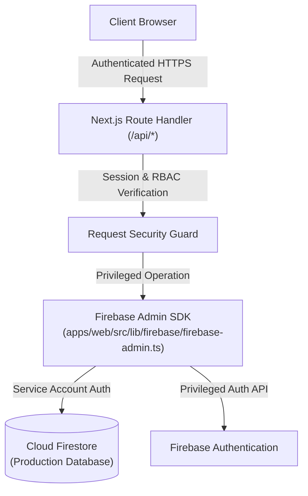

# Firebase Admin SDK Architecture & Privileged Operations

**Gateway Software Solutions (GSS) Management System**  
**Document ID:** `DOC-INT-002`  
**Classification:** Enterprise Systems Integration Standard  
**Status:** Production Ready  
**Last Updated:** 2026-09-30  

---

## 1. Architectural Role of Firebase Admin SDK

The **Firebase Admin SDK** operates exclusively within the **server-side runtime (Next.js Route Handlers & Node.js scripts)**. It possesses privileged administrative access to bypass client-side security rules when executing authorized corporate operations.



---

## 2. Privileged Operational Capabilities

Implemented in [`firebase-admin.ts`](file:///c:/Users/jasva/Desktop/project/GMS/apps/web/src/lib/firebase/firebase-admin.ts):

1. **Authoritative User Identity Lookups (`getFirestoreUserByIdentifier`):**
   * Searches the canonical `users` collection by primary email, verified mobile number, or Staff ID.
   * Resolves the full user profile including salted password hashes for authentication verification.
2. **Seamless Password Upgrade Pipeline (`syncUserToFirestore`):**
   * When legacy plain-text passwords or outdated hashes authenticate successfully, the Admin SDK computes a cryptographic Scrypt digest and updates the user document in-place.
3. **Privileged Task Allocations (`createFirestoreTask`, `updateFirestoreTask`):**
   * Creates cross-branch tasks, manages multi-assignee arrays, and records state transitions in `history`.
4. **Student Record Management (`createFirestoreStudent`, `updateFirestoreStudent`):**
   * Commits admissions records, updates mentorship assignments, and tracks fee/project statuses.
5. **Immutable Audit Logging (`logFirestoreAudit`):**
   * Appends non-repudiable audit log documents into the `audit_logs` collection.

---

## 3. Service Account Credential Resolution

To guarantee portability across local development, Docker containers, and Vercel serverless environments, `firebase-admin.ts` implements a multi-tier credential fallback strategy:

```typescript
// Resolution priority:
// 1. Injected environment variables: GOOGLE_SERVICE_ACCOUNT_EMAIL + GOOGLE_PRIVATE_KEY
// 2. GOOGLE_APPLICATION_CREDENTIALS file path
// 3. Local service account JSON keys (management-system-*.json, firebase-admin-key.json)
```

> ⚠️ **Security Mandate:** Service account keys must never be exposed to the client bundle or committed to public version control. In production environments, credentials must be supplied via secure environment variables.
