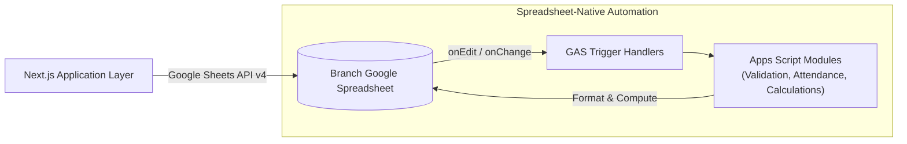

# Google Apps Script (GAS) Architecture & Integration Guide

**Gateway Software Solutions (GSS) Management System**  
**Document ID:** `DOC-INT-001`  
**Classification:** Enterprise Systems Integration Standard  
**Status:** Production Ready  
**Last Updated:** 2026-09-30  

---

## 1. Architectural Purpose of Google Apps Script

In the GSS multi-branch ecosystem, **Google Apps Script (GAS)** functions as the **spreadsheet-native automation engine** embedded inside each branch's Google Spreadsheet.

### Critical Boundaries
1. **Spreadsheet-Side Only:** Apps Script handles formula recalculations, conditional formatting, data validation drop-downs, and automated summary tab aggregation.
2. **Non-Competing:** Apps Script does **not** create competing records or write back to Firestore directly; Cloud Firestore remains the sole transactional source of truth.

---

## 2. Codebase Organization (`google-apps-script/`)

The [google-apps-script/](file:///c:/Users/jasva/Desktop/project/GMS/google-apps-script) directory contains 15 modular script files bound to the branch spreadsheets:

| Script File | Functional Responsibilities |
| :--- | :--- |
| `Config.gs` | Branch identifiers, spreadsheet IDs, tab name constants, and color palettes. |
| `Code.gs` | Menu initializers, custom UI triggers, and spreadsheet lifecycle event listeners. |
| `Attendance.gs` | Working days calendar generation, status dropdown formatting, and calculation of net working hours. |
| `Employee.gs` | Automated formatting for `02_Staff_Directory` and sub-sheet provisioning hooks. |
| `Student.gs` | Formatting, validation, and status tracking for `06_Student_Directory`. |
| `Task.gs` | In-place status updates for single-row multi-assignee task allocations. |
| `Dashboard.gs` | Derived metric computation for branch executive summary views. |
| `Audit.gs` | Append-only logging of spreadsheet-side changes into `09_System_Audit_Log`. |
| `Validation.gs` | Strict cell-level data validation rules and input guards. |
| `Utils.gs` | Date parsing, color converters, range manipulation utilities. |
| `Admin.gs` | Administrator operations and permission checks within the spreadsheet. |
| `HR.gs` | Candidate lead ingestion and stage progression logic. |
| `Intern.gs` | Intern attendance tracking and mentor alignment helpers. |
| `Firebase.gs` | Webhook receiver / endpoint adapter definitions. |
| `appsscript.json` | Google Apps Script manifest (OAuth scopes and runtime version). |

---

## 3. Provisioning & Deployment Procedures

For full instructions on binding these scripts to your branch spreadsheets via Google Clasp or the Google Apps Script Web Editor, refer to [apps-script-provisioning.md](file:///c:/Users/jasva/Desktop/project/GMS/docs/runbooks/apps-script-provisioning.md).
