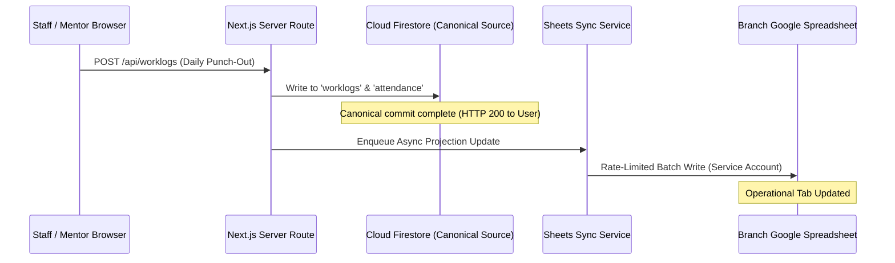

# Google Sheets Operational Projection & Synchronization Guide

**Gateway Software Solutions (GSS) Management System**  
**Document ID:** `DOC-OPS-001`  
**Classification:** Enterprise Operations Manual  
**Status:** Production Ready  
**Last Updated:** 2026-09-30  

---

## 1. Architectural Philosophy: The 1-Way Operational Projection

In the GSS platform, **Google Sheets is an asynchronous, controlled operational projection** of the canonical Firestore database—**not** the transactional source of truth.



### Architectural Benefits:
1. **Zero UI Blocking:** Fast user interactions commit immediately to Cloud Firestore; spreadsheet latency does not stall end users.
2. **Spreadsheet Visibility for Executives:** Non-technical branch stakeholders, accountants, and directors can review branch operations directly in familiar Google Sheets grids.
3. **Quota Protection:** Google Sheets API limits (300 requests per minute per project, 60 requests per minute per user) are actively managed through batching, deduplication, and exponential backoff.

---

## 2. Four-Branch Spreadsheet Registry

Each operational branch maintains an independent, dedicated Google Spreadsheet:

| Branch Code | Branch Name | Regional Location | Production Spreadsheet ID |
| :---: | :--- | :--- | :--- |
| **`CHN`** | Gateway Chennai Branch | Chennai, Tamil Nadu | `1dfKmBvtc15H8JC-tybDMiBOfD0nVScDG1kR6Hpd-bxY` |
| **`CBE`** | Gateway Coimbatore Branch | Coimbatore, Tamil Nadu | `1pu0IxgbFYwSVXycWXVepXp76476SH1j7a-VxfY_cOnA` |
| **`MDU`** | Gateway Madurai Branch | Madurai, Tamil Nadu | `1j8JjIXk-9MyvkDTImXr5nZqsihRH5dvIDNluukS0LZ8` |
| **`ERD`** | Gateway Erode Branch | Erode, Tamil Nadu | `1PqPiWkXdelII7IaS5Ua-LJ1vsswYEQVG9YHynMoPegY` |

---

## 3. Spreadsheet Architecture: Common vs Sub-Sheets

Each branch spreadsheet follows a **Hybrid Enterprise Tab Architecture**:

```
[ BRANCH SPREADSHEET (e.g. Coimbatore) ]
├── COMMON TABS (Shared branch-wide records)
│   ├── 02_Staff_Directory    — Master roster of all branch personnel
│   ├── 04_Staff_Attendance   — Master daily attendance grid (all employees)
│   ├── 06_Student_Directory  — Branch-wide student admissions
│   ├── 08_Candidate_Leads    — HR admissions pipeline & intake
│   └── 09_System_Audit_Log   — Append-only operations journal
│
└── PER-EMPLOYEE SUB-SHEETS (Dynamically provisioned per staff member)
    ├── WL_{Staff_ID}         — Daily punch records & worklogs (e.g. WL_CBE_EMP01)
    ├── STU_{Staff_ID}        — Mentorship cohort roster (e.g. STU_CBE_EMP01)
    └── TSK_{Staff_ID}        — Tasks delegated to this staff member (e.g. TSK_CBE_EMP01)
```

### 3.1 Common Tabs Definition

1. **`02_Staff_Directory`**:
   * Columns: `Staff_ID`, `Full_Name`, `Role`, `Branch`, `Email`, `Mobile`, `Designation`, `Department`, `Join_Date`, `Status`.
2. **`04_Staff_Attendance`**:
   * Columns: `Date`, `Day`, `Staff_ID`, `Staff_Name`, `Role`, `Status`, `Login_Time`, `Logout_Time`, `Working_Hours`, `Verified_By`.
3. **`06_Student_Directory`**:
   * Columns: `Student_ID`, `Student_Name`, `College`, `Department`, `Year`, `Contact_Email`, `Mobile`, `Course`, `Domain`, `Mentor_ID`, `Admission_Date`, `Fee_Status`, `Status`.
4. **`08_Candidate_Leads`**:
   * Columns: `Lead_ID`, `Candidate_Name`, `Mobile`, `Email`, `College`, `Degree`, `Interested_Domain`, `Intake_Date`, `Pipeline_Stage`, `Assigned_HR`.

### 3.2 Per-Employee Sub-Sheets Definition

* **`WL_{Staff_ID}` (Daily Worklogs):**
  * Tracks individual daily contributions with columns: `Date`, `Login_Time`, `Logout_Time`, `Total_Hours`, `Planned_Tasks`, `Completed_Tasks`, `Incomplete_Reason`, `Sync_Status`.
* **`STU_{Staff_ID}` (Assigned Mentorship Cohort):**
  * Tracks students mentored by this specific employee, including milestone grades and practical submissions.
* **`TSK_{Staff_ID}` (Assigned Deliverables):**
  * Tracks delegated tasks, priorities, deadlines, and state transitions.

---

## 4. Maintenance & Synchronization Procedures

### 4.1 Non-Destructive Tab Provisioning
When onboarding new employees, administrators run the automated synchronization tool to dynamically generate missing sub-sheets without disturbing historical data:

```bash
# Non-destructive sync: creates missing employee tabs across all branches
node scripts/initialize-branches.js --sync

# Branch-specific synchronization (e.g. Coimbatore)
node scripts/initialize-branches.js --branch CBE --sync
```

### 4.2 Full Spreadsheet Formatting & Architecture Initialization
For setting up a newly commissioned branch spreadsheet or repairing corrupted formulas:

```bash
# Initialize formatting, headers, alternating row colors, and validation rules
node scripts/initialize-branches.js --branch ERD
```

---

## 5. Rate Limiting, Backoff & Quota Resiliency

To prevent HTTP 429 quota exhaustion on high-volume days:

1. **Request Batching:** Rather than issuing individual cell updates, `sheets-service.ts` batches append operations into grouped array payloads (`spreadsheets.values.append` / `batchUpdate`).
2. **Exponential Backoff:** If Google returns a 429 or 503 error, the client initiates backoff retries:
   $$\text{Delay} = \min(1000 \times 2^{\text{attempt}} + \text{jitter}, 16000)\text{ ms}$$
3. **In-Flight Locking:** Prevents multiple concurrent threads from overwriting the same sub-sheet range concurrently.
